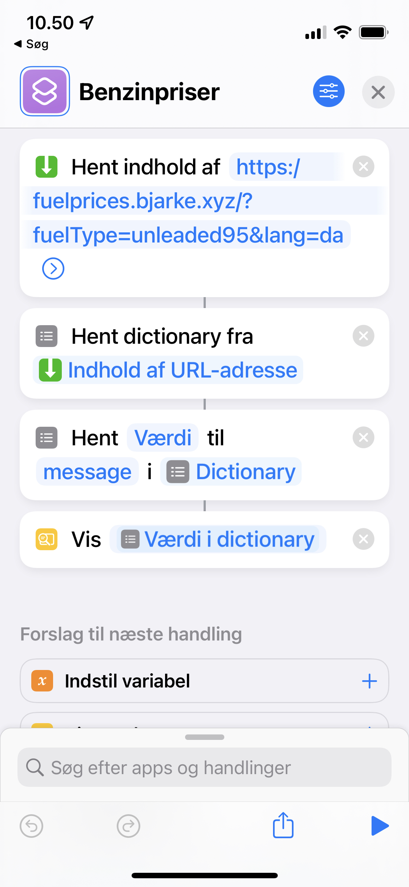

# Fuelprices

HTTP API for checking fuel prices.

## iOS Shortcut
Created to be used with an iOS shortcut, so it can be called while driving, via Siri. To use with Siri, activate Siri and say the name of the iOS shortcut (in example below: 'Benzinpriser'). Siri will read the message property of the JSON result.

Example shortcut: (domain is now `fuelprices-api.bjarke.xyz` instead of `fuelprices.bjarke.xyz`)

